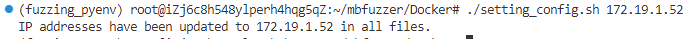
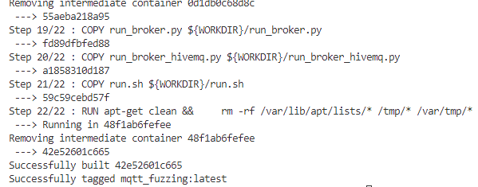
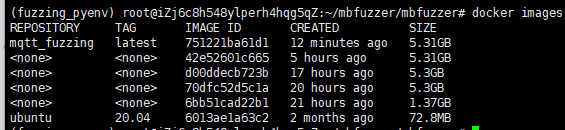
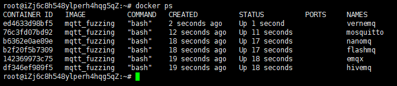
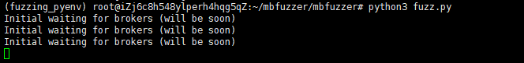
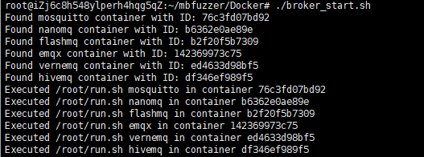
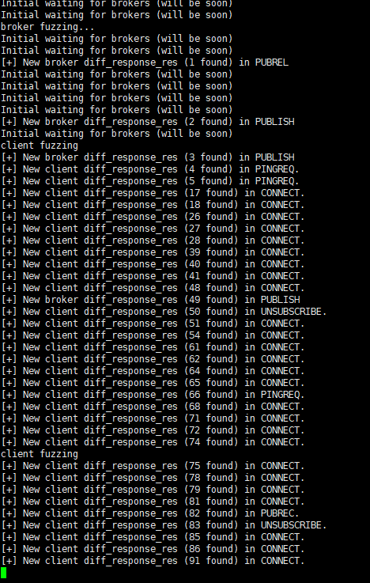
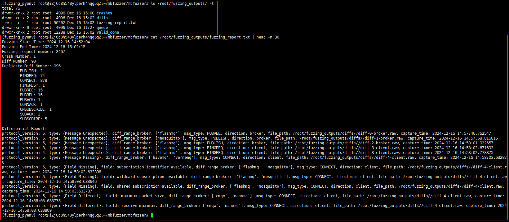

# MBFuzzer: A Multi-party Protocol Fuzzer for MQTT Brokers

MBFuzzer is a multi-party black-box fuzzer for MQTT brokers.

The code in this repository is divided into two parts:

* `Docker`:  a simplified evaluation environment.

* `MBFuzzer`: source code of MBFuzzer

  * `fuzz.py`：main function of MBFuzzer
  * `fuzzer/`：fuzzing module
  * `parsers/`：response message module
  * `generators/`：key core of the test case generation module
  * `global.py`：global parameters
  * `llm-based_bug_analyzer`: source code of the LLM-based non-compliance bug analyzer
    * `replay_all.py`：Automated bug analysis script  
  
* **Usage Example**

> We performed a clean setup and verification in an Ubuntu 20.04 environment with 4GB of RAM to ensure that MBFuzzer and Docker images were correctly built and executed.

#### Test Infrastructure Overview

* MBFuzzer Execution Environment: MBFuzzer will be executed on a local machine running Ubuntu 20.04 & Python 3.8.
* Broker Deployment: Each broker will be deployed as a Docker container.

#### Preparatory Phase

On the local machine, complete the following steps to resolve dependencies:
```bash
apt install python3.8-venv
cd <parent directory of mbfuzzer> && python3 -m venv pyenv
source pyenv/bin/activate
pip3 install numpy colorama pandas openai
```
Next, configure the IP address of the Docker container. An automated script is provided for this step:
```bash
cd Docker/
./setting_config.sh <your local machine IP>
```
You can retrieve your local machine's IP address using the ifconfig command. For example, the IP there might be 172.19.1.52.




To build the Docker image, execute the following commands:

```bash
cd <directory of Dockerfile>
docker build . -t mqtt_fuzzing -f Dockerfile
```
The process may take a few minutes. Upon successful completion, you should see the following output:




The size of the Docker images totals 5.31 GB:




To deploy the Docker images, follow these steps:
1. Ensure that the specified subnet is not occupied:
```bash
docker network create --subnet=172.199.0.0/16 mqtt_network 
```

2. Start each MQTT broker as a Docker container:
```bash
docker run -itd --privileged --name=hivemq --net mqtt_network --ip 172.199.0.2 mqtt_fuzzing bash 
docker run -itd --privileged --name=vernemq --net mqtt_network --ip 172.199.0.3 mqtt_fuzzing bash 
docker run -itd --privileged --name=emqx --net mqtt_network --ip 172.199.0.4 mqtt_fuzzing bash 
docker run -itd --privileged --name=flashmq --net mqtt_network --ip 172.199.0.5 mqtt_fuzzing bash 
docker run -itd --privileged --name=nanomq --net mqtt_network --ip 172.199.0.6 mqtt_fuzzing bash 
docker run -itd --privileged --name=mosquitto --net mqtt_network --ip 172.199.0.7 mqtt_fuzzing bash 
```




##### Fuzzing Phase

Before starting the fuzzing process, update the following two parameters in mbfuzzer/global.py:

```python
# Time limit (seconds)
TIME_LIMITE_SECONDS = 1800

# Output Directory for fuzzing
FUZZING_OUTPUT_DIR = "/root/fuzzing_outputs/"
```

Once the parameters are configured, start MBFuzzer using the following command (ensure the Python virtual environment is activated):

```bash
python3 ./fuzz.py
```

After that, mbfuzzer will wait until all brokers start up:



Simultaneously, start all MQTT brokers by running the following script:

```bash
cd Docker/
./broker_start.sh
```


After approximately 50 seconds, you should observe the fuzzing process starting:



After approximately 30 minutes (we set TIME_LIMITE_SECONDS to 1800), or when the process is manually stopped using Ctrl+C, the fuzzing outputs will be saved in the specified directory:



##### LLM-based bug analyzer

To analyze the results using the LLM-based bug analyzer, follow these steps:

1. Extract relevant files from the fuzzing report:
```bash
cd mbfuzzer/llm-based_bug_analyzer
python3 extract_files.py /root/fuzzing_outputs/fuzzing_report.txt 
```
This generates a file named raw_list.txt in the current directory.

2. Set the OpenAI API key as an environment variable:
```bash
export OPENAI_API_KEY=xxxx
```

3. Run the analysis script:
```bash
python3 replay_all.py raw_list.txt llm_output.txt
```

